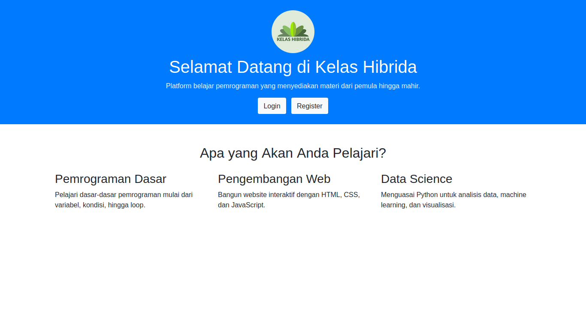
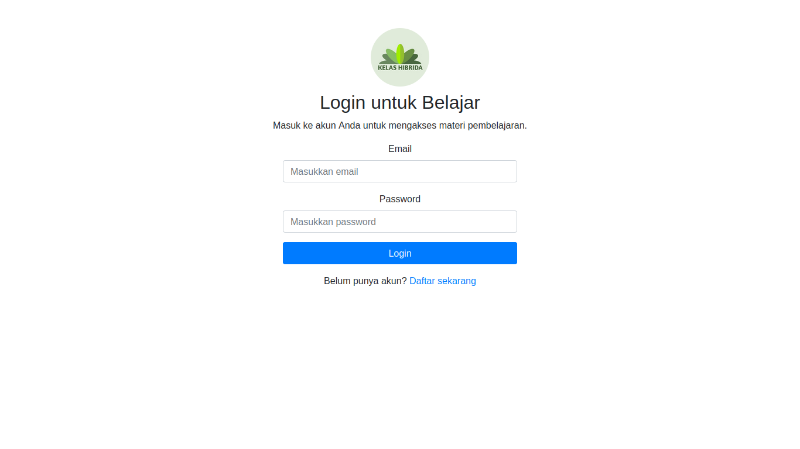
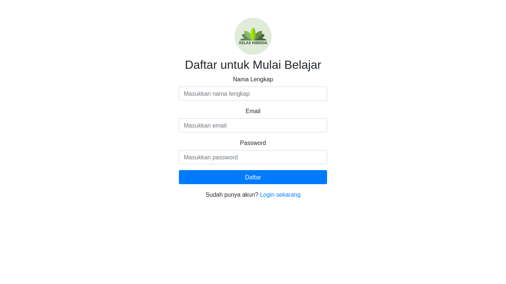
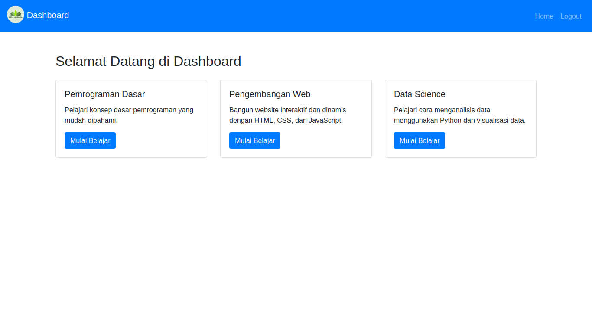

# Rangkuman Materi Komponen Bootstrap 4

## 1. Layout Grid System

Bootstrap 4 memiliki sistem grid 12 kolom yang dapat dibagi menjadi beberapa bagian sesuai kebutuhan.

**Contoh Penggunaan Grid**

```html
<div class="container">
  <div class="row">
    <div class="col-md-4">
      <h3>Pemrograman Dasar</h3>
      <p>Pelajari dasar-dasar pemrograman mulai dari variabel, kondisi, hingga loop.</p>
    </div>
    <div class="col-md-4">
      <h3>Pengembangan Web</h3>
      <p>Bangun website interaktif dengan HTML, CSS, dan JavaScript.</p>
    </div>
    <div class="col-md-4">
      <h3>Data Science</h3>
      <p>Menguasai Python untuk analisis data, machine learning, dan visualisasi.</p>
    </div>
  </div>
</div>
```

---

## 2. Navbar

Komponen **Navbar** digunakan untuk membuat menu navigasi yang responsif.

**Contoh Navbar Sederhana**

```html
<nav class="navbar navbar-expand-lg navbar-light bg-light">
  <a class="navbar-brand" href="#">Belajar Pemrograman</a>
  <button class="navbar-toggler" type="button" data-toggle="collapse" data-target="#navbarNav" aria-controls="navbarNav" aria-expanded="false" aria-label="Toggle navigation">
    <span class="navbar-toggler-icon"></span>
  </button>
  <div class="collapse navbar-collapse" id="navbarNav">
    <ul class="navbar-nav ml-auto">
      <li class="nav-item">
        <a class="nav-link" href="index.html">Home</a>
      </li>
      <li class="nav-item">
        <a class="nav-link" href="login.html">Login</a>
      </li>
      <li class="nav-item">
        <a class="nav-link" href="register.html">Register</a>
      </li>
    </ul>
  </div>
</nav>
```

---

## 3. Button

**Button** Bootstrap digunakan untuk membuat tombol dengan berbagai gaya dan ukuran.

**Contoh Tombol**

```html
<a href="login.html" class="btn btn-primary">Login</a>
<a href="register.html" class="btn btn-secondary">Register</a>
```

> **Catatan:** Bootstrap 4 memiliki berbagai kelas untuk tombol, seperti `btn-primary`, `btn-secondary`, `btn-success`, `btn-danger`, dan sebagainya untuk warna yang berbeda.

---

## 4. Card

**Card** adalah komponen Bootstrap yang digunakan untuk membuat konten terstruktur dengan heading, teks, dan elemen lainnya.

**Contoh Card**

```html
<div class="card" style="width: 18rem;">
  
  <div class="card-body">
    <h5 class="card-title">Pemrograman Dasar</h5>
    <p class="card-text">Pelajari dasar pemrograman mulai dari variabel, kondisi, hingga loop.</p>
    <a href="#" class="btn btn-primary">Mulai Belajar</a>
  </div>
</div>
```

---

## 5. Form

**Form** adalah komponen utama yang digunakan untuk halaman **Login** dan **Register**. Bootstrap menyediakan kelas untuk menata elemen form seperti input, label, dan tombol.

**Contoh Form Login**

```html
<form>
  <div class="form-group">
    <label for="email">Email:</label>
    <input type="email" class="form-control" id="email" placeholder="Enter email">
  </div>
  <div class="form-group">
    <label for="password">Password:</label>
    <input type="password" class="form-control" id="password" placeholder="Password">
  </div>
  <button type="submit" class="btn btn-primary">Login</button>
</form>
```

---

## 6. Alert

**Alert** digunakan untuk menampilkan pesan informasi, seperti pesan sukses atau kesalahan pada halaman Login atau Register.

**Contoh Alert Sukses**

```html
<div class="alert alert-success" role="alert">
  Pendaftaran berhasil! Silakan login untuk masuk.
</div>
```

> **Catatan:** Bootstrap 4 memiliki beberapa warna untuk alert, seperti `alert-success`, `alert-danger`, `alert-warning`, dan `alert-info`.

---

## 7. Badge

**Badge** adalah elemen kecil yang digunakan untuk menampilkan informasi atau notifikasi dalam ukuran kecil, biasanya ditampilkan di samping judul atau ikon.

**Contoh Badge**

```html
<h1>Notifikasi <span class="badge badge-primary">4</span></h1>
```

---

## 8. Rounded Image (Profil)

Dengan menggunakan kelas `rounded-circle`, gambar dapat tampil dalam bentuk bulat (sering digunakan untuk ikon profil).

**Contoh Gambar Bulat**

```html

```

# Tugas Membuat Tampilan

## Halaman Utama (Home)

[](index.html)

Halaman ini berisi informasi utama tentang situs, serta tautan untuk login dan register.

---

## Halaman Login

[](login.html)

Halaman ini digunakan untuk login ke dalam aplikasi.

---

## Halaman Register

[](register.html)

Halaman ini digunakan untuk mendaftar akun baru pada situs.

---

## Halaman Dashboard Pengguna

[](dashboard.html)

Setelah login, pengguna akan diarahkan ke halaman ini untuk melihat informasi dan menu utama.
